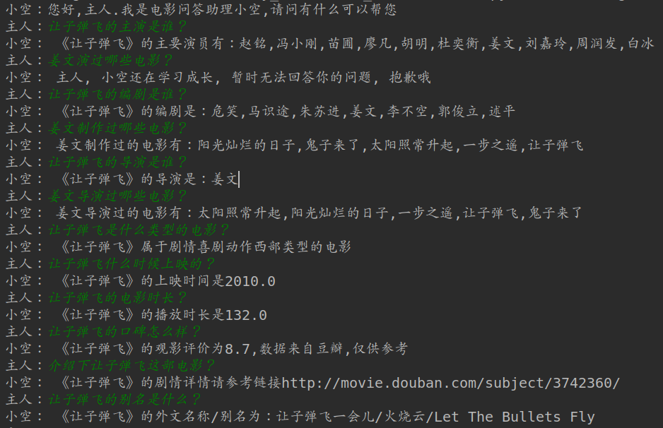

## **基于KnowledgeGraph的电影问答系统**

本项目利用OpenKG.CN社区浙大提供的电影数据集构建了以电影为中心的知识图谱，并以该知识图谱完成自动问答应用的实现。

- 主要工作
  1. 基于电影数据集构建电影知识图谱
  2. 基于电影知识图谱的自动问答
- 环境准备
  - 系统：Ubuntu 18.04LTS
  - IDE：Pycharm
  - 图数据库：neo4j-community-3.5.7

- 项目运行方法

  ```Python
  # 首次运行chat.py中QA类start_up参数设置为True，进行冷启动。之后，将其设置为False
  ./env/python   chat.py
  ```

- 脚本结构

  - data_utils.py：数据处理及图谱构建脚本
  - question_analysis_tools：问题解析及答案生成工具包
  - chat.py：问答入口脚本

- 知识图谱实体类型、关系类型及属性类型

  | **实体类型** | **中文含义** | **实体数量** |
  | :----------: | :----------: | :----------: |
  |    Movie     |   电影内容   |     4504     |
  |   Director   |     导演     |     2923     |
  |   Composer   |    制作人    |     5179     |
  |    Actor     |     演员     |    16523     |

  |  关系类型   | 中文含义 | 关系数量 |
  | :---------: | :------: | :------: |
  |    Lead     |   主导   |   5188   |
  |   Create    |   创作   |   8628   |
  | Participate |   参与   |  36367   |

  | 属性类型  | 中文含义 |                       举例                        |
  | :-------: | :------: | :-----------------------------------------------: |
  |   title   | 电影名称 |                     让子弹飞                      |
  |    url    | 简介链接 |     http://movie.douban.com/subject/3742360/      |
  |   rate    | 电影评分 |                        8.7                        |
  | category  | 电影类别 |          '剧情', '喜剧', '动作', '西部'           |
  | showtime  | 上映日期 |                      2010.0                       |
  |  length   | 电影时长 |                       132.0                       |
  | othername | 电影别名 | '让子弹飞一会儿', '火烧云', 'Let The Bullets Fly' |

- 支持问答类型

  |    问句类型     |   中文含义   |           举例           |
  | :-------------: | :----------: | :----------------------: |
  |   movie_actor   |  电影的主演  |    让子弹飞的主演是谁    |
  |    act_movie    |  演过的电影  |     姜文演过哪些电影     |
  | movie_composer  | 电影的制作人 |    让子弹飞的编剧是谁    |
  |  compose_movie  | 制作过的电影 |    姜文制作过哪些电影    |
  | movie_director  |  电影的导演  |    让子弹飞的导演是谁    |
  |  direct_movie   | 导演过的电影 |    姜文导演过哪些电影    |
  | movie_category  |   电影类别   | 让子弹飞是什么类型的电影 |
  | movie_showtime  | 电影上映时间 |  让子弹飞什么时候上映的  |
  |  movie_length   |   电影时长   |    让子弹飞的电影时长    |
  |   movie_rate    |   电影评分   |   让子弹飞的口碑怎么样   |
  |   movie_desc    |   电影简介   |  介绍下让子弹飞这部电影  |
  | movie_othername |   电影别名   |   让子弹飞的别名是什么   |

- 问答结果展示

  